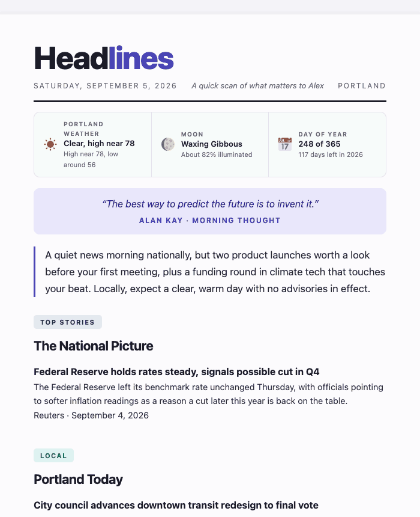
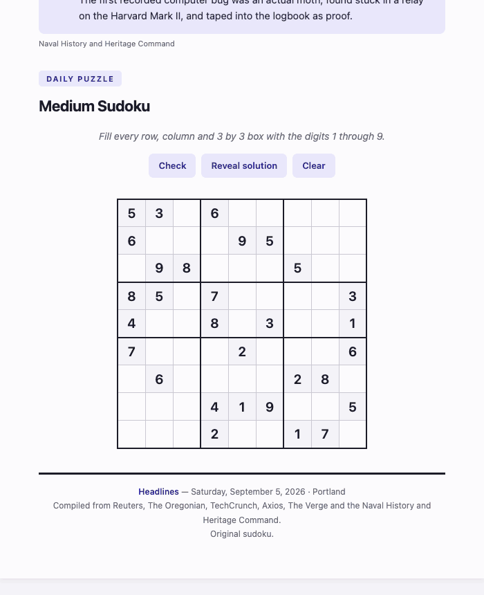

# Headlines: A Daily Newspaper Claude Writes Just for You

Headlines is a Claude skill that turns your interests into a personalized,
daily newspaper, automatically.

Each edition brings together the news and information you care about, and
packages it all into a digital newspaper designed to be useful, personal,
and fun.



*Sample edition; the stories and sources shown are illustrative.*

Your edition can include personalized news, local weather, daily context,
recommendations, and interactive puzzles, with topics and sections that
adapt to what you want to follow.



*Sample edition; the stories and sources shown are illustrative.*

## What it does

Headlines can:

* Find and summarize news based on your interests
* Include local news, weather, and other daily context
* Remember previously covered stories to reduce repetition
* Generate an interactive Sudoku or Word Search
* Create both HTML and PDF editions
* Save each edition locally
* Run automatically on a schedule
* Adapt as your interests and preferences change

Each newspaper is generated from your own configuration, so two people using
Headlines won't get the same edition.

## How it works

Set up Headlines with the topics you want to follow, your location,
preferred sections, and other preferences. Claude uses that information to
research and assemble each edition.

Once configured, Headlines can run as a scheduled task, giving you a new
personalized newspaper without having to prompt Claude from scratch each
day.

## FYI

You do not need to know how to code to set this up. You do need a Claude plan
that supports scheduled tasks, recurring automated runs, with file access.
Check Anthropic's current documentation for which plans include this.

You only need to go through setup once. After that, it runs automatically on
the days and time you chose. How long it runs depends entirely on how much you
choose to include. It shows you a draft first and only treats an edition as
final once you confirm.

Editions are saved to a folder on your computer. Email delivery is not
available yet, though it may come in a later version.

## Install

1. Copy the contents of SKILL.md into a new Claude scheduled task, or if your
   Claude environment supports installing skills from a folder, place the
   whole headlines_skill folder wherever your environment looks for skills.
2. Give the task access to a folder on your computer where it can write
   files, wherever you like. A suggested layout:

   ```
   Daily Newspaper/
     Newspapers/
       Drafts/          today's unsaved draft always lands here
     Config/
       preferences.md   your answers from the setup interview live here
       dedup_log.json   Claude's memory of what it already reported
   ```

   You do not need to create these files yourself. Claude creates them the
   first time it runs.
3. Run the task once, manually. Claude will ask the setup questions below,
   then build a trial edition right in that same conversation so you can see
   exactly what it looks like before anything runs on a schedule.

A note on scheduling: since this skill saves editions to a folder on your own
computer, it needs to run as a local scheduled task rather than a cloud based
one. Local scheduled tasks only fire while the relevant Claude app is open and
your computer is awake, so if your computer is asleep at the scheduled time,
the run is skipped and picked up the next time you reopen the app. Check
Anthropic's current documentation for the exact behavior on your setup, since
this can change.

## First Run: Answering a few questions

The very first time it runs, Claude asks a short set of questions instead of
jumping straight to building a paper. Answer in plain sentences, there is no
form to fill out. The required questions need an answer before the first
edition can be built, since the report genuinely cannot be assembled without
them. The optional questions can be skipped for now and answered later.

Required:

* What topics or beats do you want covered? Three to six things, a field, a
  hobby, a team, whatever matters to you.
* What city should the weather and almanac details reflect? This is required
  even if you have no interest in local news itself, so the masthead always
  has a location.
* What time should this run, and on which days? Every day, weekdays only, or
  a custom set of days you name.
* Where should editions be saved on your computer? Pick a folder.

Optional:

* Do you want to keep the name "Headlines," or would you rather change it?
  If you would like a different name, Claude will offer a few suggestions or
  you can just tell it what you want to call it.
* Who is this for, and what is your world? Your name or handle, and a one
  line "I'm a ___ who cares about ___."
* Any sources you especially trust or want prioritized?
* Any sources you would rather Claude not use at all?
* Would you like a dedicated local news section for the city you gave above,
  real local stories and things to do, or would you rather leave local news
  out of the report entirely?
* How long should reading it take, and what tone? It really depends on how
  much you choose to include, so do not worry about picking an exact number.
* Do you want a daily puzzle? Choose sudoku only, word search only, or have
  it rotate between the two. If you choose sudoku, word search, or both,
  also say what difficulty level you want for each, easy, medium, or hard.
  Also, what accent color would you like? The default is indigo.

Once you have answered the required questions, Claude builds a full trial
edition right away, in that same conversation, before setting up the actual
recurring schedule. Look it over and ask for whatever changes you want, tone,
length, which topics landed well, the design, the puzzle, anything else.
Claude updates your preferences immediately and can rebuild the trial as many
times as you like. The recurring schedule only starts once you say the trial
looks good.

## Changing your mind later

Just tell it in plain language any time, "drop the tennis section," "make
this shorter," "switch the color to green," and it updates your saved
preferences right away, no need to redo the whole interview.

## How saving works

Every run builds a full draft in your Drafts folder automatically, no
confirmation needed for that step. At the end of each run, Claude asks
something like:

"Reply save it if you would like today's edition kept permanently."

If you do not reply, that is fine. The draft simply stays in the Drafts
folder until you either confirm it or let a later day's edition take its
place.

## Customizing further

Everything that makes the paper function, the draft first saving, the
duplicate story checking, the section order, the PDF export, lives in
SKILL.md and should not need editing. Everything that makes it yours, your
topics, tone, length, color, and which puzzle you chose, lives in
Config/preferences.md and is meant to be edited freely, either by you
directly or by asking Claude to update it for you. The actual look of the
paper, fonts, spacing, colors, the almanac strip, the sudoku, is captured in
reference/design_template.html, a working copy of the real design this skill
is built around. A new user's first edition starts from that file, and every
edition after that matches whatever the previous one looked like.

## License

MIT, see the LICENSE file. In short, you can use, copy, modify, and share
this freely, as long as the copyright notice in that file stays attached to
any copy you distribute.
